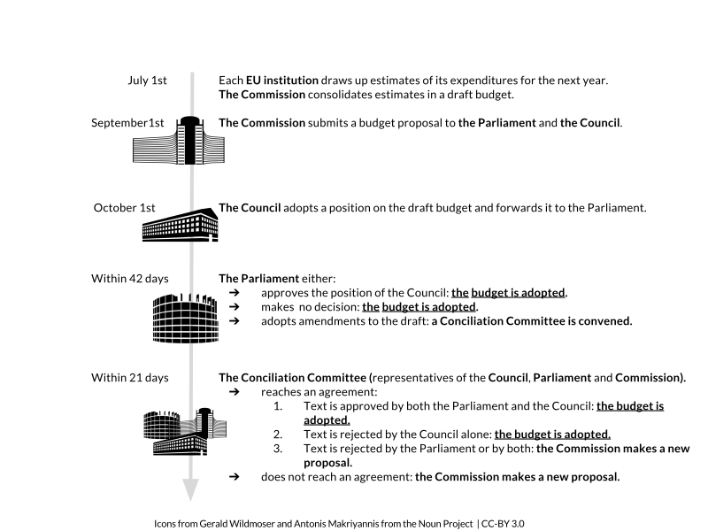

Unlike most national budgets which are only set up on an annual basis, the EU budget is set up through two main instruments: the Multiannual Financial Framework (MFF) for the long term, and a more standard annual budget regulation.

The Multiannual Financial Framework
-----------------------------------

The MFF is an instrument which sets the maximum annual amounts - or “ceilings” - which the EU may spend in different political fields - or “headings” - for a period of at least 5 years. In practice, the MFF is adopted for a period of 7 years and the current one is applicable for the years 2014-2020.[^ftnt2]

The MFF takes the form of a Council regulation, adopted following a special legislative procedure called the consent procedure:

1.  The European Commission submits a proposal for an MFF regulation;
2.  The European Parliament accepts or rejects the proposal by an absolute majority vote - but it cannot amend the proposal;
3.  After the approval of the European Parliament, the Council adopts the MFF Regulation by a unanimous vote.

Through the MFF regulation, ceilings for each year concerning commitment appropriations and payment appropriations are determined for each of the MFF headings. Headings change from one MFF to the other, making comparisons difficult over the years.

For the period 2014/2020, the headings are:

-   Smart and inclusive growth including:

-   Competitiveness for growth and jobs;
-   Economic, social and territorial cohesion;

-   Sustainable growth: natural resources;
-   Security and citizenship;
-   Global Europe;
-   Administration;
-   Compensation.

The framework also sets up ceilings for a number of instruments established outside the general headings and known as the Flexibility and Special Instruments, such as (1) the Emergency Aid Reserve; (2) the European Union Solidarity Fund; (3) the Flexibility Instrument;[^ftnt3] (4) the European Globalisation Adjustment Fund; (5) the Contingency Margin; (6) the Global Margin for commitments for growth and employment, in particular youth employment. These instruments enable the EU to mobilise the necessary funds to react to unforeseen events (financial crisis, emergency situations).

One specific instrument, the European Development Fund (EDF) is managed outside the framework of the MFF and governed by its own set of rules. The EDF provides development aid to African, Caribbean and Pacific (ACP) countries, as well as to Overseas Countries and Territories (OCTs). It is based on an ACP-EU Partnership Agreement known as the “Cotonou Agreement”, which is revised every five years, and it is financed by direct contributions from EU Member States. The resources for the current EDF amount to 30.5 billion euros for the period 2014 - 2020.

### What are Commitment and Payment Appropriations?

In the EU annual budget and in the MFF regulations, authorised expenditure amounts are expressed in both commitment and payment appropriations.

-   Commitments are legal pledges to provide finance, provided that certain conditions are fulfilled. The EU commits itself to reimburse its share of the costs of an EU-funded project when the project is completed.
-   Payments are cash or bank transfers to beneficiaries. Today’s commitments are tomorrow’s payments.[^ftnt4]

This means for instance that 2015 payments are actually 2014 commitments. In practice, this implies that the EU does not finance a project in advance. Someone, a Member State in most of the cases, would have to provide the funds beforehand before being reimbursed by the EU.

The ceilings of the 2014-2020 MFF are 959,988 billion euros in commitment appropriations and 908,4 billion euros in payment appropriations.

This represents a decrease compared to the 2007-2013 MFF, whose ceiling in commitment appropriations was up to 994,176 billion euros.

The main areas concerned by this decrease are:

-   The Cohesion Policy, under the heading Smart and Inclusive Growth (-8%);
-   The Agriculture and Rural Development Policy, under the heading Sustainable Growth: Natural Resources (-11%).[^ftnt5]

The EU Annual Budget
--------------------

Every year, a regulation is adopted to set up the annual budget of the EU. This budget is based on the MFF and the procedure followed is the ordinary legislative procedure.[^ftnt6] One of the guiding principles for establishing the annual budget is that “the revenue and expenditure shown in the budget must be in balance”.[^ftnt7]

Figure 1: EU annual budget regulation adoption procedure

Source: European Commission | [SVG version available here](https://drive.google.com/open?id=0BxUOTiQczyxHaDBqSmdDR0FTRlE&authuser=0)

The annual budget regulation is divided into several sections detailing, for each of the EU institutions, the relevant revenue, expenditure and staff allocated. The largest section of the regulation concerns the European Commission, which is responsible for managing the EU policies.

For the year 2015, the budget amounts to:

-   €145.321 billion in commitment appropriations;
-   €141.214 billion in payment appropriations (this represents an increase of 1,57% compared to the 2014 EU annual budget);
-   €141.214 billion in budgetary revenue.[^ftnt8]

It is possible to amend the budget after its adoption.

[Annual activity reports](http://ec.europa.eu/atwork/synthesis/aar/index_en.htm) are prepared every year by each Directorate-General (DG) and contain the DG’s annual accounts and financial reports. These reports are summarised in a synthesis report, sent to the European Parliament, the Council and the European Court of Auditors (ECA).

In addition, an annual report on budgetary and financial management is published every year by the Commission.[^ftnt9] 

In November every year, the Court of Auditors publishes public reports on the implementation of the EU budget and the EDF by the Commission. Based on these reports, the European Parliament expresses an opinion on the implementation of the budget by the European Commission. If this opinion is positive, it means that the Parliament has granted discharge to the Commission for this financial year.[^ftnt10]

* * * * *

[^ftnt1]: For example, see this analysis from the Robert Schuman Foundation on recent opinion polls: [http://www.robert-schuman.eu/en/european-issues/0333-overcoming-democratic-breakdown-in-the-european-union](http://www.robert-schuman.eu/en/european-issues/0333-overcoming-democratic-breakdown-in-the-european-union) 

[^ftnt2]: See [Council regulation n°1311/2013 of 2 December 2013 laying down the multiannual financial framework for the years 2014-2020](http://eur-lex.europa.eu/legal-content/EN/TXT/?uri=uriserv:OJ.L_.2013.347.01.0884.01.ENG).

[^ftnt3]: The Flexibility Instrument was used to finance the Juncker Plan: [http://ec.europa.eu/priorities/jobs-growth-investment/plan/docs/an-investment-plan-for-europe\_com\_2014\_903\_en.pdf.](http://ec.europa.eu/priorities/jobs-growth-investment/plan/docs/an-investment-plan-for-europe_com_2014_903_en.pdf.)

[^ftnt4]: See [the EU Funding Glossary](http://ec.europa.eu/budget/funding/information/eu-funding-glossary_en).

[^ftnt5]: See [the Assembly of European Regions briefing note](http://www.aer.eu/fileadmin/user_upload/MainIssues/Future_of_Europe/EU_Budget_Review/MFF-briefing-note.pdf).

[^ftnt6]: [The ordinary legislative procedure step by step.](http://www.europarl.europa.eu/aboutparliament/en/20150201PVL00004/Legislative-powers)

[^ftnt7]: Article 310 of the Treaty on the Functioning of the European Union (TFEU).

[^ftnt8]: [Definitive adoption (EU, EURATOM) 2015/339 of the European Union's general budget for the financial year 2015](http://eur-lex.europa.eu/legal-content/EN/TXT/?uri=OJ:L:2015:069:FULL)

[^ftnt9]: The 2014 report is available online: [http://ec.europa.eu/budget/library/biblio/publications/2014/2015.04.15\_RBFM\_Report\_en.pdf](http://ec.europa.eu/budget/library/biblio/publications/2014/2015.04.15_RBFM_Report_en.pdf)

[^ftnt10]: [Reports of the ECA.](http://www.eca.europa.eu/en/Pages/AuditReportsOpinions.aspx)

[^ftnt11]: [Council Decision of 7 June 2007 on the system of the European Communities' own resources.](http://eur-lex.europa.eu/legal-content/EN/TXT/?uri=CELEX:32007D0436)

[^ftnt12]: [2014 Council Decision on the system of own resources of the European Union.](http://register.consilium.europa.eu/doc/srv?l=EN&f=ST%205602%202014%20INIT)

[^ftnt13]: As the UK rebate, lump sum payments and reduced VAT call rates are correction mechanisms, that is to say measures taken to compensate Member States whose contribution to the EU budget is perceived as being too high compared to their relative wealth and the benefits they get out of the EU budget.

[^ftnt14]: [Council regulation (EU) 2015/323 of 2 March 2015 on the financial regulation applicable to the 11th European Development Fund](http://eur-lex.europa.eu/legal-content/EN/TXT/?uri=uriserv:OJ.L_.2015.058.01.0017.01.ENG)

[^ftnt15]: See for example [this presentation](http://ec.europa.eu/chafea/documents/health/calls/2013/Workshop_on_Joint_Action_2013/Financial_Managment_JA%20Workshop_December_2012.pdf).

[^ftnt16]: [The 12 highlights for the 2014/2020 MFF.](http://ec.europa.eu/budget/mff/highlights/index_en.cfm#funding)

[^ftnt17]: Europe 2020 is the 10-year growth strategy of the European Union for the period 2010-2020. See [http://ec.europa.eu/europe2020/index\_en.htm](http://ec.europa.eu/europe2020/index_en.htm).

[^ftnt18]: [European Commission ESIF webpage.](http://ec.europa.eu/contracts_grants/funds_en.htm)

[^ftnt19]: Initial amount was €74 928 million but in accordance with regulation 1303/2013 (art. 92(6) and 92(7)), parts of this amount have been transferred to the Connecting Europe Facility and to the Fund for European Aid to the Most Deprived.

[^ftnt20]: For example, concerning the exact amount of the five ESIF for the 2014-2020 period, one EU publication mentions a number of [366.9 billion euros](http://ec.europa.eu/contracts_grants/pdf/synergies_beneficiaries_en.pdf) whereas another one makes reference to a total of [351.8 billion euros](http://ec.europa.eu/regional_policy/sources/docgener/panorama/pdf/mag48/mag48_en.pdf).

[^ftnt21]: It should be noted, however, that DG BUDGET, the EU Directorate-General for Budget, was quite responsive to the requests for information sent by the authors of the report through social medias such as Twitter.

[^ftnt22]: The Directive  2012/17/EU introduces a unique identifier for European companies. However, there is no provision for that unique identifier to be used in data on EU funds beneficiaries. See [http://eur-lex.europa.eu/legal-content/EN/TXT/?uri=CELEX:32012L0017](http://eur-lex.europa.eu/legal-content/EN/TXT/?uri=CELEX:32012L0017)

[^ftnt23]: [2012 financial regulation, Articles 34 and 35](http://eur-lex.europa.eu/LexUriServ/LexUriServ.do?uri=OJ:L:2012:298:0001:0096:EN:PDF).

[^ftnt24]: The threshold can be set by Member States, see article 12 of regulation 1306/2013: [http://ec.europa.eu/agriculture/cap-funding/beneficiaries/shared/index\_en.htm](http://ec.europa.eu/agriculture/cap-funding/beneficiaries/shared/index_en.htm).

[^ftnt25]: For a good introduction to data journalism, see Gray, J., Bounegru, L. and Chambers, L. (eds.) The Data Journalism Handbook (O'Reilly Media, 2012), co-edited by Open Knowledge and the European Journalism Center and freely available [online.](http://datajournalismhandbook.org/)

[^ftnt26]: For an in depth-review of journalism investigation on EU funds up to 2012, see: European Commission, Deterrence of fraud with EU funds through investigative journalism in EU-27, 2012, [http://www.journalismfund.eu/sites/default/files/EP%20Study%20-%20Deterrence%20of%20fraud.pdf](http://www.journalismfund.eu/sites/default/files/EP%20Study%20-%20Deterrence%20of%20fraud.pdf).

[^ftnt27]: ICIJ, €6 billion in subsidies fuel Spain’s ravenous fleet, October 2011, [online.](http://www.icij.org/project/looting-seas-ii/nearly-eu6-billion-subsidies-fuel-spains-ravenous-fleet)

[^ftnt28]: ICIJ,  [methodology](http://www.icij.org/project/looting-seas-ii/subsidy-methodology).

[^ftnt29]: European Commission, Deterrence of fraud with EU funds through investigative journalism in EU-27, p. 227,2012:[http://www.journalismfund.eu/sites/default/files/EP%20Study%20-%20Deterrence%20of%20fraud.pdf](http://www.journalismfund.eu/sites/default/files/EP%20Study%20-%20Deterrence%20of%20fraud.pdf).

[^ftnt30]: See, James T Hamilton, Democracy's Detectives: The Economics and Impacts of Investigative Reporting (forthcoming).

[^ftnt31]: [TFUE](http://eur-lex.europa.eu/legal-content/FR/TXT/?uri=CELEX:12012E/TXT).
