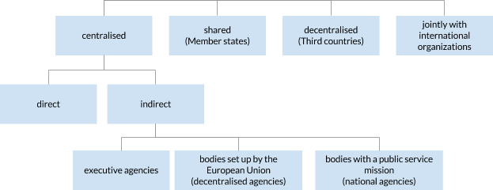

The European Commission has the overall responsibility of the implementation of the EU budget, but does not directly manage all EU funds. Indeed, these funds can be spent in several different ways:

-   Through centralised management: the money is managed directly by the European Commission (e.g. through the selection of contractors or the award of grants) - this is centralised direct management - or indirectly by EU executive agencies, decentralised agencies or national agencies - this is centralised indirect management;
-   Through shared management (this method accounts for around 80% of the EU budget): there is a delegation of budget implementation to EU Member States;
-   Through decentralised management: there is a delegation of budget implementation to non-EU countries;
-   Through joint management: there is a delegation of budget implementation to intergovernmental and international organisations.

One fund can be spent in different ways (for example, through centralised and shared management). For each fund, a specific regulation is adopted which defines the rules related to its implementation.

Figure 3. Budget Management Overview

Source: [European Commission](http://ec.europa.eu/budget/explained/management/managt_who/who_en.cfm)

Ultimately, a large number of entities are involved in the spending of the EU budget.

-   The Commission itself and its agencies. In that case, money will be directly spent through grants, contracts, or administrative expenditures.
-   National and regional authorities in EU Member States;
-   Authorities in non-EU countries which receive financial support from the EU;
-   International organisations such as the United Nations or the World Bank.

As a general rule, the co-financing principle usually applies to EU spending, especially when it comes to shared management. Through this rule, part of the cost of an action or the running costs of an entity is borne by the beneficiary of the grant or by contributors other than the European Commission, with the aim to make beneficiaries responsible for the operational and financial viability of their projects. Some flexibility nevertheless exists to allow for the full financing of some projects with EU funds.

Other rules usually applicable to funding projects with EU money are: the non-profit rule; the non-retroactivity rule and the non-cumulative rule.[^ftnt15]

* * * * *

[^ftnt1]: For example, see this analysis from the Robert Schuman Foundation on recent opinion polls: [http://www.robert-schuman.eu/en/european-issues/0333-overcoming-democratic-breakdown-in-the-european-union](http://www.robert-schuman.eu/en/european-issues/0333-overcoming-democratic-breakdown-in-the-european-union) 

[^ftnt2]: See [Council regulation n°1311/2013 of 2 December 2013 laying down the multiannual financial framework for the years 2014-2020](http://eur-lex.europa.eu/legal-content/EN/TXT/?uri=uriserv:OJ.L_.2013.347.01.0884.01.ENG).

[^ftnt3]: The Flexibility Instrument was used to finance the Juncker Plan: [http://ec.europa.eu/priorities/jobs-growth-investment/plan/docs/an-investment-plan-for-europe\_com\_2014\_903\_en.pdf.](http://ec.europa.eu/priorities/jobs-growth-investment/plan/docs/an-investment-plan-for-europe_com_2014_903_en.pdf.)

[^ftnt4]: See [the EU Funding Glossary](http://ec.europa.eu/budget/funding/information/eu-funding-glossary_en).

[^ftnt5]: See [the Assembly of European Regions briefing note](http://www.aer.eu/fileadmin/user_upload/MainIssues/Future_of_Europe/EU_Budget_Review/MFF-briefing-note.pdf).

[^ftnt6]: [The ordinary legislative procedure step by step.](http://www.europarl.europa.eu/aboutparliament/en/20150201PVL00004/Legislative-powers)

[^ftnt7]: Article 310 of the Treaty on the Functioning of the European Union (TFEU).

[^ftnt8]: [Definitive adoption (EU, EURATOM) 2015/339 of the European Union's general budget for the financial year 2015](http://eur-lex.europa.eu/legal-content/EN/TXT/?uri=OJ:L:2015:069:FULL)

[^ftnt9]: The 2014 report is available online: [http://ec.europa.eu/budget/library/biblio/publications/2014/2015.04.15\_RBFM\_Report\_en.pdf](http://ec.europa.eu/budget/library/biblio/publications/2014/2015.04.15_RBFM_Report_en.pdf)

[^ftnt10]: [Reports of the ECA.](http://www.eca.europa.eu/en/Pages/AuditReportsOpinions.aspx)

[^ftnt11]: [Council Decision of 7 June 2007 on the system of the European Communities' own resources.](http://eur-lex.europa.eu/legal-content/EN/TXT/?uri=CELEX:32007D0436)

[^ftnt12]: [2014 Council Decision on the system of own resources of the European Union.](http://register.consilium.europa.eu/doc/srv?l=EN&f=ST%205602%202014%20INIT)

[^ftnt13]: As the UK rebate, lump sum payments and reduced VAT call rates are correction mechanisms, that is to say measures taken to compensate Member States whose contribution to the EU budget is perceived as being too high compared to their relative wealth and the benefits they get out of the EU budget.

[^ftnt14]: [Council regulation (EU) 2015/323 of 2 March 2015 on the financial regulation applicable to the 11th European Development Fund](http://eur-lex.europa.eu/legal-content/EN/TXT/?uri=uriserv:OJ.L_.2015.058.01.0017.01.ENG)

[^ftnt15]: See for example [this presentation](http://ec.europa.eu/chafea/documents/health/calls/2013/Workshop_on_Joint_Action_2013/Financial_Managment_JA%20Workshop_December_2012.pdf).

[^ftnt16]: [The 12 highlights for the 2014/2020 MFF.](http://ec.europa.eu/budget/mff/highlights/index_en.cfm#funding)

[^ftnt17]: Europe 2020 is the 10-year growth strategy of the European Union for the period 2010-2020. See [http://ec.europa.eu/europe2020/index\_en.htm](http://ec.europa.eu/europe2020/index_en.htm).

[^ftnt18]: [European Commission ESIF webpage.](http://ec.europa.eu/contracts_grants/funds_en.htm)

[^ftnt19]: Initial amount was €74 928 million but in accordance with regulation 1303/2013 (art. 92(6) and 92(7)), parts of this amount have been transferred to the Connecting Europe Facility and to the Fund for European Aid to the Most Deprived.

[^ftnt20]: For example, concerning the exact amount of the five ESIF for the 2014-2020 period, one EU publication mentions a number of [366.9 billion euros](http://ec.europa.eu/contracts_grants/pdf/synergies_beneficiaries_en.pdf) whereas another one makes reference to a total of [351.8 billion euros](http://ec.europa.eu/regional_policy/sources/docgener/panorama/pdf/mag48/mag48_en.pdf).

[^ftnt21]: It should be noted, however, that DG BUDGET, the EU Directorate-General for Budget, was quite responsive to the requests for information sent by the authors of the report through social medias such as Twitter.

[^ftnt22]: The Directive  2012/17/EU introduces a unique identifier for European companies. However, there is no provision for that unique identifier to be used in data on EU funds beneficiaries. See [http://eur-lex.europa.eu/legal-content/EN/TXT/?uri=CELEX:32012L0017](http://eur-lex.europa.eu/legal-content/EN/TXT/?uri=CELEX:32012L0017)

[^ftnt23]: [2012 financial regulation, Articles 34 and 35](http://eur-lex.europa.eu/LexUriServ/LexUriServ.do?uri=OJ:L:2012:298:0001:0096:EN:PDF).

[^ftnt24]: The threshold can be set by Member States, see article 12 of regulation 1306/2013: [http://ec.europa.eu/agriculture/cap-funding/beneficiaries/shared/index\_en.htm](http://ec.europa.eu/agriculture/cap-funding/beneficiaries/shared/index_en.htm).

[^ftnt25]: For a good introduction to data journalism, see Gray, J., Bounegru, L. and Chambers, L. (eds.) The Data Journalism Handbook (O'Reilly Media, 2012), co-edited by Open Knowledge and the European Journalism Center and freely available [online.](http://datajournalismhandbook.org/)

[^ftnt26]: For an in depth-review of journalism investigation on EU funds up to 2012, see: European Commission, Deterrence of fraud with EU funds through investigative journalism in EU-27, 2012, [http://www.journalismfund.eu/sites/default/files/EP%20Study%20-%20Deterrence%20of%20fraud.pdf](http://www.journalismfund.eu/sites/default/files/EP%20Study%20-%20Deterrence%20of%20fraud.pdf).

[^ftnt27]: ICIJ, €6 billion in subsidies fuel Spain’s ravenous fleet, October 2011, [online.](http://www.icij.org/project/looting-seas-ii/nearly-eu6-billion-subsidies-fuel-spains-ravenous-fleet)

[^ftnt28]: ICIJ,  [methodology](http://www.icij.org/project/looting-seas-ii/subsidy-methodology).

[^ftnt29]: European Commission, Deterrence of fraud with EU funds through investigative journalism in EU-27, p. 227,2012:[http://www.journalismfund.eu/sites/default/files/EP%20Study%20-%20Deterrence%20of%20fraud.pdf](http://www.journalismfund.eu/sites/default/files/EP%20Study%20-%20Deterrence%20of%20fraud.pdf).

[^ftnt30]: See, James T Hamilton, Democracy's Detectives: The Economics and Impacts of Investigative Reporting (forthcoming).

[^ftnt31]: [TFUE](http://eur-lex.europa.eu/legal-content/FR/TXT/?uri=CELEX:12012E/TXT).
