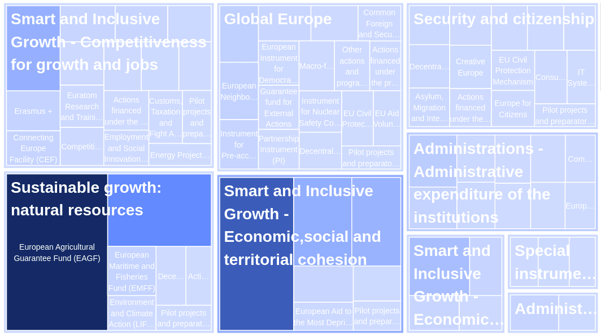
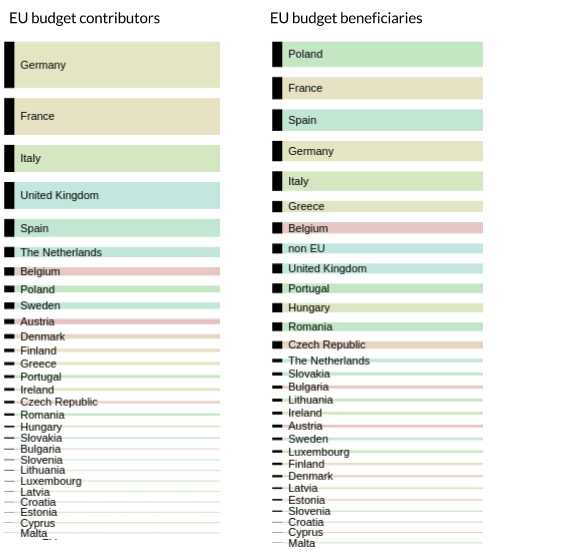

The European Union has a budget to pay for policies carried out at the European level and for the institutions deciding, managing and implementing these policies (the Commission and its Directorates-General, the Parliament, the agencies, the Council, etc.).

The spending priorities are set in the MFF when defining the amount of the funds under its headings. For the 2014-2020 MFF, the priorities are creating growth and jobs and reducing economic gaps between the EU's various regions.[^ftnt16] Agriculture, rural development, fisheries and environmental protection account for a major share of the budget.

Each heading is then split into programmes and funds which finance the implementation of EU policies. The final beneficiaries can be any person or organisation (company, research organisation, local council, etc.) from the EU Member States and beyond.

As the programmes and funds are managed by various entities belonging or not to the EU institutions, there is currently no central database of all the EU spending beneficiaries. 

The European Structural and Investment Funds (ESIF)

A very large amount of the EU budget is spent through 5 funds known as the European Structural and Investment Funds (ESIF). Indeed, with a total of 366.9 billion euros for the 2014-2020 period, the ESIF make up more than one third of the EU’s budget. To these funds, in addition to the specific regulations regarding their implementation, applies a single set of common rules defined in the [Common Provisions regulation](http://eur-lex.europa.eu/legal-content/EN/TXT/?uri=uriserv:OJ.L_.2013.347.01.0320.01.ENG), with the objectives of:

-   Establishing a clear link with the Europe 2020 Strategy;[^ftnt17]
-   Improving coordination;
-   Ensuring consistent implementation;
-   Making access to the funds as straightforward as possible for those who may benefit from them.[^ftnt18]

The ESIF are managed under the shared management mechanism, which provides that Members States are co-responsible for the funds and, as such, must comply with specific control and audit procedures.

In 2014, Member States had to prepare and negotiate with the Commission so-called Partnership Agreements (strategic plans with their investment priorities covering the five ESIF). Then, they adopted Operational Programmes, which break down the investment priorities and objectives of the Partnership Agreements into concrete actions. The Operational Programmes are managed by the managing/national authorities appointed by each Member State. Applications for funding are then submitted to the national or regional authority managing the relevant programme.

The  5 ESIF  for the 2014-2020 period are:

-   The Cohesion Fund (CF);
-   The European Agricultural Fund for Rural Development (EARDF);
-   The European Maritime and Fisheries Fund (EMFF)
-   The European Regional Development Fund (ERDF);
-   The European Social Fund (ESF).

Below are details for each of the 5 ESIF.

The Cohesion Fund (CF)
----------------------

<table>
<col width="50%" />
<col width="50%" />
<tbody>
<tr class="odd">
<td align="left">
MFF heading
</td>
<td align="left">
Smart and Inclusive Growth - Economic, Social and Territorial Cohesion
</td>
</tr>
<tr class="even">
<td align="left">
Funds
</td>
<td align="left">
Cohesion Fund
</td>
</tr>
<tr class="odd">
<td align="left">
Policy supported
</td>
<td align="left">
Regional and Urban Policy
</td>
</tr>
<tr class="even">
<td align="left">
2014-2020 MFF ceiling
</td>
<td align="left">
€63 399 millionf="#ftnt19">[19]</a>
</td>
</tr>
<tr class="odd">
<td align="left">
Managing Member States
</td>
<td align="left">
Bulgaria, Croatia, Cyprus, Czech Republic, Estonia, Greece, Hungary, Latvia, Lithuania, Malta, Poland, Portugal, Romania, Slovakia, Slovenia
</td>
</tr>
<tr class="even">
<td align="left">
Managing Directorate-General
</td>
<td align="left">
Directorate-General for Regional and Urban Policy (DG REGIO)
</td>
</tr>
<tr class="odd">
<td align="left">
Website
</td>
<td align="left">
<a href="http://www.google.com/url?q=http%3A%2F%2Fec.europa.eu%2Fregional_policy%2Fen%2Ffunding%2Fcohesion-fund%2F&amp;sa=D&amp;sntz=1&amp;usg=AFQjCNEgETvDTaMF2PdIsBX4sNYQ68Shcw">http://ec.europa.eu/regional_policy/en/funding/cohesion-fund/</a>
</td>
</tr>
</tbody>
</table>

The aim of the CF is to reduce economic and social disparities and to promote sustainable development in Member States whose GNI per inhabitant is less than 90% of the EU average. The funding goes to activities supporting the establishment of trans-European transport networks or to projects related to energy or transport as long as they clearly benefit the environment.

Beneficiaries: 

-   For funds under shared management, DG REGIO manages a website with a map providing direct links to lists of beneficiaries provided by EU Member States, but the page does not make a clear distinction between the beneficiaries of spending under the CF or under the European Regional Development Fund (ERDF): [http://ec.europa.eu/regional\_policy/en/atlas/beneficiaries/](http://ec.europa.eu/regional_policy/en/atlas/beneficiaries/)
-   For funds under centralised direct management, a list of beneficiaries until 2013 is available in the FTS, under the heading “Cohesion Funds”: [http://ec.europa.eu/budget/fts/index\_en.htm](http://ec.europa.eu/budget/fts/index_en.htm)

The European Agricultural Fund for Rural Development (EAFRD)
------------------------------------------------------------

<table>
<col width="50%" />
<col width="50%" />
<tbody>
<tr class="odd">
<td align="left">
MFF heading
</td>
<td align="left">
Sustainable Growth: Natural Resources
</td>
</tr>
<tr class="even">
<td align="left">
Funds
</td>
<td align="left">
European Agricultural Fund for Rural Development (EAFRD)
</td>
</tr>
<tr class="odd">
<td align="left">
Policy supported
</td>
<td align="left">
Agriculture and Rural Development
</td>
</tr>
<tr class="even">
<td align="left">
2014-2020 MFF ceiling
</td>
<td align="left">
€95 577.052 million
</td>
</tr>
<tr class="odd">
<td align="left">
Managing Member States
</td>
<td align="left">
EU28
</td>
</tr>
<tr class="even">
<td align="left">
Managing Directorate-General
</td>
<td align="left">
Directorate-General for Agriculture and Rural Development (DG AGRI)
</td>
</tr>
<tr class="odd">
<td align="left">
Website
</td>
<td align="left">
<a href="http://www.google.com/url?q=http%3A%2F%2Fec.europa.eu%2Fagriculture%2Fcap-funding%2Findex_en.htm&amp;sa=D&amp;sntz=1&amp;usg=AFQjCNHjpAxMmKUfPl4Sq-ss3GEJiRfyHw">http://ec.europa.eu/agriculture/cap-funding/index_en.htm</a>
</td>
</tr>
</tbody>
</table>

The EAFRD is one of the two EU funds which finance the Common Agricultural Policy (CAP), the other one being the European Agricultural Guarantee Fund (EAGF), which is not an ESIF. The CAP, the agricultural policy of the EU, was established in 1962 and last reformed in 2013 to focus on 3 priorities: (i) viable food production; (ii) sustainable management of natural resources; (iii) balanced development of rural areas throughout the EU. In this context, the EAFRD focuses on the EU’s contribution to rural development programmes and is implemented through shared management with EU Member States.

The overall CAP budget has decreased over the years, but still represents a significant share of the EU budget: from 71% in 1984 to 39% in 2013.

Beneficiaries:

-   For funds under shared management, DG AGRI manages a website with links to Member States websites providing information on beneficiaries of CAP payments (although there is no clear distinction between beneficiaries of the EAFRD and the EAGF): [http://ec.europa.eu/agriculture/cap-funding/beneficiaries/shared/index\_en.htm](http://ec.europa.eu/agriculture/cap-funding/beneficiaries/shared/index_en.htm)
-   For funds under centralised direct management, a list of beneficiaries until 2013 is available in the FTS: [http://ec.europa.eu/budget/fts/index\_en.htm](http://ec.europa.eu/budget/fts/index_en.htm)

The European Maritime and Fisheries Fund (EMFF)
-----------------------------------------------

<table>
<col width="50%" />
<col width="50%" />
<tbody>
<tr class="odd">
<td align="left">
MFF heading
</td>
<td align="left">
Sustainable Growth: Natural Resources
</td>
</tr>
<tr class="even">
<td align="left">
Funds
</td>
<td align="left">
European Maritime and Fisheries Fund (EMFF). Previously called the Financial Instrument for Fisheries Guidance (FIFG - for the period 1996-2006) and the European Fisheries Fund (EFF - for the period 2007-2013)
</td>
</tr>
<tr class="odd">
<td align="left">
Policy supported
</td>
<td align="left">
Maritime Affairs and Fisheries
</td>
</tr>
<tr class="even">
<td align="left">
2014-2020 MFF ceiling
</td>
<td align="left">
€7 404.84 million
</td>
</tr>
<tr class="odd">
<td align="left">
Managing Member States
</td>
<td align="left">
EU28, Luxembourg excepted
</td>
</tr>
<tr class="even">
<td align="left">
Managing Directorate-General
</td>
<td align="left">
Directorate-General for Maritime Affairs and Fisheries (DG MARE)
</td>
</tr>
<tr class="odd">
<td align="left">
Website
</td>
<td align="left">
<a href="http://www.google.com/url?q=http%3A%2F%2Fec.europa.eu%2Ffisheries%2Fcfp%2Femff%2Findex_en.htm&amp;sa=D&amp;sntz=1&amp;usg=AFQjCNF-06Kb8QI47cnCwh7gH4ik-JmoXA">http://ec.europa.eu/fisheries/cfp/emff/index_en.htm</a>
</td>
</tr>
</tbody>
</table>

The EMFF supports the implementation of the European Common Fisheries Policy (CFP) and of the EU Integrated Maritime Policy (IMP) for the period 2014-2020. The objectives of the EMFF are: i) to help fishermen in the transition to sustainable fishing; ii) to support coastal communities in diversifying their economies; iii) to finance projects that create new jobs and improve quality of life along European coasts. In order to reach this objective, 11% of the fund is managed directly by the European Commission to support EU-wide objectives in maritime and coastal affairs, whereas the remaining 89% are managed by EU Member States on the basis of co-financing. In the last case, each country is allocated a share of the total fund budget, based on the size of its fishing industry - this makes Spain the biggest beneficiary of the EMFF.

A part of the MFF ceiling dedicated to the EMFF (€900 million) has been attributed to the establishment and management of sustainable fisheries partnership agreements with third countries. Very often criticised, these partnership agreements obey to different financial rules than the general rules applicable to the EMFF (see: [http://ec.europa.eu/fisheries/cfp/international/agreements/index\_en.htm](http://ec.europa.eu/fisheries/cfp/international/agreements/index_en.htm)).

Beneficiaries:

-   For funds under shared management, DG MARE maintains a website with links to the websites of Member States providing information on beneficiaries of EMFF payments (although, for some countries, the information presented seems to be outdated): [http://ec.europa.eu/fisheries/contracts\_and\_funding/the\_european\_transparency\_initiative/index\_en.htm](http://ec.europa.eu/fisheries/contracts_and_funding/the_european_transparency_initiative/index_en.htm) 
-   For funds under centralised direct management, a list of beneficiaries until 2013 is available in the FTS: [http://ec.europa.eu/budget/fts/index\_en.htm](http://ec.europa.eu/budget/fts/index_en.htm)

The European Regional Development Fund (ERDF)
---------------------------------------------

<table>
<col width="50%" />
<col width="50%" />
<tbody>
<tr class="odd">
<td align="left">
MFF heading
</td>
<td align="left">
Smart and Inclusive Growth - Economic, Social and Territorial Cohesion
</td>
</tr>
<tr class="even">
<td align="left">
Funds
</td>
<td align="left">
Less-developed regions; More developed regions; Outermost and sparsely populated regions; Transition regions; Territorial cooperation.
</td>
</tr>
<tr class="odd">
<td align="left">
Policy supported
</td>
<td align="left">
Regional and Urban Policy
</td>
</tr>
<tr class="even">
<td align="left">
2014-2020 MFF ceiling
</td>
<td align="left">
€187.4 million
</td>
</tr>
<tr class="odd">
<td align="left">
Managing Member States
</td>
<td align="left">
EU28
</td>
</tr>
<tr class="even">
<td align="left">
Managing Directorate-General
</td>
<td align="left">
Directorate-General for Regional and Urban Policy (DG REGIO)
</td>
</tr>
<tr class="odd">
<td align="left">
Website
</td>
<td align="left">
<a href="http://www.google.com/url?q=http%3A%2F%2Fec.europa.eu%2Fregional_policy%2Fen%2Ffunding%2Ferdf%2F&amp;sa=D&amp;sntz=1&amp;usg=AFQjCNHK0H2lwmOYvrJGuHVALuPMzjEE-g">http://ec.europa.eu/regional_policy/en/funding/erdf/</a> 
</td>
</tr>
</tbody>
</table>

The ERDF was established in 1975. For the 2014-2020 period, its objectives are to strengthen economic and social cohesion in the EU by correcting imbalances between its regions. To do so, it focuses on several key priority areas: (i) innovation and research; (ii) the digital agenda; (iii) support for small and medium-sized enterprises; (iv) the low-carbon economy.

EU regions are classified into several categories (see [the map presenting this classification](http://ec.europa.eu/regional_policy/en/policy/how/is-my-region-covered/)). Depending on this classification, different rules apply:

-   In more developed regions, at least 80% of the funds must focus on at least two of the key priorities;
-   This is 60% of the funds in transition regions;
-   And 50% in less-developed regions.

Implementation of the ERDF is made at the regional and national levels through the principles of shared management and of co-financing. The Commission retains a supervisory role.

The ERDF is not established as such in the MFF and in the annual budget regulations. The money channeled through this fund comes from different budget lines, such as “Less-developed regions”, “More developed regions” or “Transition regions”. These budget lines are also used to finance other funds such as the European Social Fund (ESF), making it difficult for the public to determine the exact amount of money invested in the ERDF.

Beneficiaries:

-   For funds under shared management, DG REGIO maintains a website with links to the websites of Member States providing information on beneficiaries of ERDF payments (although the data is mixed up with the one provided for the Cohesion Fund): [http://ec.europa.eu/regional\_policy/en/atlas/beneficiaries/](http://ec.europa.eu/regional_policy/en/atlas/beneficiaries/)
-   For funds under centralised direct management, a list of beneficiaries until 2013 is available in the FTS: [http://ec.europa.eu/budget/fts/index\_en.htm](http://ec.europa.eu/budget/fts/index_en.htm)

The European Social Fund (ESF)
------------------------------

<table>
<col width="50%" />
<col width="50%" />
<tbody>
<tr class="odd">
<td align="left">
MFF heading
</td>
<td align="left">
Smart and Inclusive Growth - Economic, Social and Territorial Cohesion
</td>
</tr>
<tr class="even">
<td align="left">
Funds
</td>
<td align="left">
Less-developed regions; More-developed regions; Transition regions; Youth Employment Initiative
</td>
</tr>
<tr class="odd">
<td align="left">
Policy supported
</td>
<td align="left">
Employment, Social Affairs and Inclusion
</td>
</tr>
<tr class="even">
<td align="left">
2014-2020 MFF ceiling
</td>
<td align="left">
€86.4 million
</td>
</tr>
<tr class="odd">
<td align="left">
Managing Member States
</td>
<td align="left">
EU28
</td>
</tr>
<tr class="even">
<td align="left">
Managing Directorate-General
</td>
<td align="left">
Directorate-General for Employment, Social Affairs and Inclusion (DG EMPL)
</td>
</tr>
<tr class="odd">
<td align="left">
Website
</td>
<td align="left">
<a href="http://www.google.com/url?q=http%3A%2F%2Fec.europa.eu%2Fesf%2Fhome.jsp%3FlangId%3Den&amp;sa=D&amp;sntz=1&amp;usg=AFQjCNHhuowUHHohNUaHr03iGu0vnC0XNg">http://ec.europa.eu/esf/home.jsp?langId=en</a>
</td>
</tr>
</tbody>
</table>

The ESF is the EU’s main instrument for supporting jobs, helping people to get better jobs and ensuring fairer job opportunities. For the 2014-2020 period, priorities are to boost the adaptability of workers; improving access to employment and helping people from disadvantaged groups to get jobs.

The ESF is implemented through the system of shared management, together with EU Member States, and according to the co-financing principle. Co-financing rates vary between 50% and 85% of the total project costs depending on the relative wealth of the region (see [the map](http://ec.europa.eu/esf/main.jsp?catId=525&langId=en) presenting the classification of the EU regions into different categories).

The ESF is not established as such in the MFF and in the annual budget regulations. The money channeled through this fund comes from different budget lines, such as “Less-developed regions”, “More developed regions” or “Transition regions”. These budget lines are also used to finance other funds such as the European Regional Development Fund (ERDF), making it difficult for the public to determine the exact amount of money invested in the ESF. In addition, and even if it is included under a different budget heading, the Youth Employment Initiative appears to be managed under the framework of the ESF.

Beneficiaries:

-   For funds under shared management, DG EMPL maintains a website with links to the websites of Member States providing information on beneficiaries of ESF payments: [http://ec.europa.eu/esf/main.jsp?catId=45&langId=en](http://ec.europa.eu/esf/main.jsp?catId=45&langId=en) 
-   For funds under centralised direct management, a list of beneficiaries until 2013 is available in the FTS: [http://ec.europa.eu/budget/fts/index\_en.htm](http://ec.europa.eu/budget/fts/index_en.htm)

* * * * *

Figure 5: Share of the EU budget per headings and funds (2015 Appropriation Commitments)

Source of the data: [European Commission](http://ec.europa.eu/budget/figures/interactive/index_en.cfm) -  Made with Many Eyes (IBM)

* * * * *

Figure 4: Members States contributors vs. beneficiaries (budget 2013)

Source of the data: [European Commission](http://ec.europa.eu/budget/figures/interactive/index_en.cfm) - Made with raw.densitydesign.org

* * * * *

All Funds
---------


[{{fund.title}}]({{ fund.url }})
{{ fund["Objectives"]}}


[^ftnt1]: For example, see this analysis from the Robert Schuman Foundation on recent opinion polls: [http://www.robert-schuman.eu/en/european-issues/0333-overcoming-democratic-breakdown-in-the-european-union](http://www.robert-schuman.eu/en/european-issues/0333-overcoming-democratic-breakdown-in-the-european-union) 

[^ftnt2]: See [Council regulation n°1311/2013 of 2 December 2013 laying down the multiannual financial framework for the years 2014-2020](http://eur-lex.europa.eu/legal-content/EN/TXT/?uri=uriserv:OJ.L_.2013.347.01.0884.01.ENG).

[^ftnt3]: The Flexibility Instrument was used to finance the Juncker Plan: [http://ec.europa.eu/priorities/jobs-growth-investment/plan/docs/an-investment-plan-for-europe\_com\_2014\_903\_en.pdf.](http://ec.europa.eu/priorities/jobs-growth-investment/plan/docs/an-investment-plan-for-europe_com_2014_903_en.pdf.)

[^ftnt4]: See [the EU Funding Glossary](http://ec.europa.eu/budget/funding/information/eu-funding-glossary_en).

[^ftnt5]: See [the Assembly of European Regions briefing note](http://www.aer.eu/fileadmin/user_upload/MainIssues/Future_of_Europe/EU_Budget_Review/MFF-briefing-note.pdf).

[^ftnt6]: [The ordinary legislative procedure step by step.](http://www.europarl.europa.eu/aboutparliament/en/20150201PVL00004/Legislative-powers)

[^ftnt7]: Article 310 of the Treaty on the Functioning of the European Union (TFEU).

[^ftnt8]: [Definitive adoption (EU, EURATOM) 2015/339 of the European Union's general budget for the financial year 2015](http://eur-lex.europa.eu/legal-content/EN/TXT/?uri=OJ:L:2015:069:FULL)

[^ftnt9]: The 2014 report is available online: [http://ec.europa.eu/budget/library/biblio/publications/2014/2015.04.15\_RBFM\_Report\_en.pdf](http://ec.europa.eu/budget/library/biblio/publications/2014/2015.04.15_RBFM_Report_en.pdf)

[^ftnt10]: [Reports of the ECA.](http://www.eca.europa.eu/en/Pages/AuditReportsOpinions.aspx)

[^ftnt11]: [Council Decision of 7 June 2007 on the system of the European Communities' own resources.](http://eur-lex.europa.eu/legal-content/EN/TXT/?uri=CELEX:32007D0436)

[^ftnt12]: [2014 Council Decision on the system of own resources of the European Union.](http://register.consilium.europa.eu/doc/srv?l=EN&f=ST%205602%202014%20INIT)

[^ftnt13]: As the UK rebate, lump sum payments and reduced VAT call rates are correction mechanisms, that is to say measures taken to compensate Member States whose contribution to the EU budget is perceived as being too high compared to their relative wealth and the benefits they get out of the EU budget.

[^ftnt14]: [Council regulation (EU) 2015/323 of 2 March 2015 on the financial regulation applicable to the 11th European Development Fund](http://eur-lex.europa.eu/legal-content/EN/TXT/?uri=uriserv:OJ.L_.2015.058.01.0017.01.ENG)

[^ftnt15]: See for example [this presentation](http://ec.europa.eu/chafea/documents/health/calls/2013/Workshop_on_Joint_Action_2013/Financial_Managment_JA%20Workshop_December_2012.pdf).

[^ftnt16]: [The 12 highlights for the 2014/2020 MFF.](http://ec.europa.eu/budget/mff/highlights/index_en.cfm#funding)

[^ftnt17]: Europe 2020 is the 10-year growth strategy of the European Union for the period 2010-2020. See [http://ec.europa.eu/europe2020/index\_en.htm](http://ec.europa.eu/europe2020/index_en.htm).

[^ftnt18]: [European Commission ESIF webpage.](http://ec.europa.eu/contracts_grants/funds_en.htm)

[^ftnt19]: Initial amount was €74 928 million but in accordance with regulation 1303/2013 (art. 92(6) and 92(7)), parts of this amount have been transferred to the Connecting Europe Facility and to the Fund for European Aid to the Most Deprived.

[^ftnt20]: For example, concerning the exact amount of the five ESIF for the 2014-2020 period, one EU publication mentions a number of [366.9 billion euros](http://ec.europa.eu/contracts_grants/pdf/synergies_beneficiaries_en.pdf) whereas another one makes reference to a total of [351.8 billion euros](http://ec.europa.eu/regional_policy/sources/docgener/panorama/pdf/mag48/mag48_en.pdf).

[^ftnt21]: It should be noted, however, that DG BUDGET, the EU Directorate-General for Budget, was quite responsive to the requests for information sent by the authors of the report through social medias such as Twitter.

[^ftnt22]: The Directive  2012/17/EU introduces a unique identifier for European companies. However, there is no provision for that unique identifier to be used in data on EU funds beneficiaries. See [http://eur-lex.europa.eu/legal-content/EN/TXT/?uri=CELEX:32012L0017](http://eur-lex.europa.eu/legal-content/EN/TXT/?uri=CELEX:32012L0017)

[^ftnt23]: [2012 financial regulation, Articles 34 and 35](http://eur-lex.europa.eu/LexUriServ/LexUriServ.do?uri=OJ:L:2012:298:0001:0096:EN:PDF).

[^ftnt24]: The threshold can be set by Member States, see article 12 of regulation 1306/2013: [http://ec.europa.eu/agriculture/cap-funding/beneficiaries/shared/index\_en.htm](http://ec.europa.eu/agriculture/cap-funding/beneficiaries/shared/index_en.htm).

[^ftnt25]: For a good introduction to data journalism, see Gray, J., Bounegru, L. and Chambers, L. (eds.) The Data Journalism Handbook (O'Reilly Media, 2012), co-edited by Open Knowledge and the European Journalism Center and freely available [online.](http://datajournalismhandbook.org/)

[^ftnt26]: For an in depth-review of journalism investigation on EU funds up to 2012, see: European Commission, Deterrence of fraud with EU funds through investigative journalism in EU-27, 2012, [http://www.journalismfund.eu/sites/default/files/EP%20Study%20-%20Deterrence%20of%20fraud.pdf](http://www.journalismfund.eu/sites/default/files/EP%20Study%20-%20Deterrence%20of%20fraud.pdf).

[^ftnt27]: ICIJ, €6 billion in subsidies fuel Spain’s ravenous fleet, October 2011, [online.](http://www.icij.org/project/looting-seas-ii/nearly-eu6-billion-subsidies-fuel-spains-ravenous-fleet)

[^ftnt28]: ICIJ,  [methodology](http://www.icij.org/project/looting-seas-ii/subsidy-methodology).

[^ftnt29]: European Commission, Deterrence of fraud with EU funds through investigative journalism in EU-27, p. 227,2012:[http://www.journalismfund.eu/sites/default/files/EP%20Study%20-%20Deterrence%20of%20fraud.pdf](http://www.journalismfund.eu/sites/default/files/EP%20Study%20-%20Deterrence%20of%20fraud.pdf).

[^ftnt30]: See, James T Hamilton, Democracy's Detectives: The Economics and Impacts of Investigative Reporting (forthcoming).

[^ftnt31]: [TFUE](http://eur-lex.europa.eu/legal-content/FR/TXT/?uri=CELEX:12012E/TXT).
