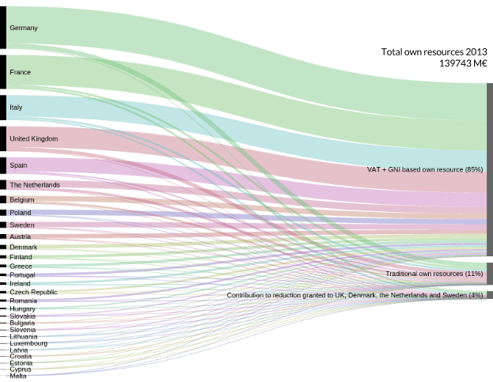

The sources of the EU revenue are called the EU’s “own resources”. A Council Decision on Own Resources, setting up the rules applying to their calculation, is usually negotiated at the same time as the MFF regulation. Resources are then provided on an annual basis.

The difference with the MFF regulation is that the Council Decision has to be approved by all the Member States before it comes into force - usually through a vote in national parliaments. This explains why, as of April 2015, the Council Decision on the EU’s own resources dates back from 2007[^ftnt11] and continues to apply until the new Council Decision, adopted in May 2014 by the Council, comes into force.[^ftnt12] When the 2014 Decision will be approved by all the Member States, it will apply retroactively as of 1 January 2014.

The EU’s own resources are divided into several categories:

-   Customs duties on EU imports: they arise from the application of the common customs tariffs and are collected on imports from third countries at the external borders of the EU.
-   Agricultural duties and sugar levies: they consist mainly of customs duties on imports from non-EU countries of agricultural products subject to the common organisation of the markets and levies on sugar, isoglucose and insulin syrup.

Customs duties, agricultural duties and sugar levies are also referred as the EU “traditional” own resources.

-   The VAT-based own resources: these are national contributions based on harmonised VAT bases for Member States.
-   The GNI-based own resources: this revenue is based on an uniform call rate applied to the Gross National Income (GNI) of each Member State.
-   Other revenues: it includes taxes on EU staff; contributions from non-Member States and fines imposed on companies.

The collection of revenues does not apply uniformly to all EU Member States, as rather ad-hoc correction mechanisms also exist. The three main correction mechanisms are:

-   The UK rebate: the UK is reimbursed a percentage of the difference between its contribution and what it receives back from the EU budget (as of today, 66% of the difference). To compensate this loss, all other Member States have to make an additional contribution to the budget in proportion to the share they contribute to the EU’s GNI. Although controversial, the UK rebate has been maintained by the 2014 Council Decision on the EU own resources;
-   Lump-sum payments: some countries (Denmark, the Netherlands and Sweden) benefit from gross reductions in their annual GNI contributions;
-   Reduced VAT call rates for Germany, the Netherlands and Sweden.[^ftnt13]

As previously noted, the European Development Fund is not concerned by these rules, as it is financed directly by the Member States and has its own financial regulations.[^ftnt14]

* * * * *

Figure 2: EU own resources contribution per Member States (Budget 2013)

Source of the data: [European Commission](http://ec.europa.eu/budget/figures/interactive/index_en.cfm) - Made with raw.densitydesign.org

* * * * *

[^ftnt1]: For example, see this analysis from the Robert Schuman Foundation on recent opinion polls: [http://www.robert-schuman.eu/en/european-issues/0333-overcoming-democratic-breakdown-in-the-european-union](http://www.robert-schuman.eu/en/european-issues/0333-overcoming-democratic-breakdown-in-the-european-union) 

[^ftnt2]: See [Council regulation n°1311/2013 of 2 December 2013 laying down the multiannual financial framework for the years 2014-2020](http://eur-lex.europa.eu/legal-content/EN/TXT/?uri=uriserv:OJ.L_.2013.347.01.0884.01.ENG).

[^ftnt3]: The Flexibility Instrument was used to finance the Juncker Plan: [http://ec.europa.eu/priorities/jobs-growth-investment/plan/docs/an-investment-plan-for-europe\_com\_2014\_903\_en.pdf.](http://ec.europa.eu/priorities/jobs-growth-investment/plan/docs/an-investment-plan-for-europe_com_2014_903_en.pdf.)

[^ftnt4]: See [the EU Funding Glossary](http://ec.europa.eu/budget/funding/information/eu-funding-glossary_en).

[^ftnt5]: See [the Assembly of European Regions briefing note](http://www.aer.eu/fileadmin/user_upload/MainIssues/Future_of_Europe/EU_Budget_Review/MFF-briefing-note.pdf).

[^ftnt6]: [The ordinary legislative procedure step by step.](http://www.europarl.europa.eu/aboutparliament/en/20150201PVL00004/Legislative-powers)

[^ftnt7]: Article 310 of the Treaty on the Functioning of the European Union (TFEU).

[^ftnt8]: [Definitive adoption (EU, EURATOM) 2015/339 of the European Union's general budget for the financial year 2015](http://eur-lex.europa.eu/legal-content/EN/TXT/?uri=OJ:L:2015:069:FULL)

[^ftnt9]: The 2014 report is available online: [http://ec.europa.eu/budget/library/biblio/publications/2014/2015.04.15\_RBFM\_Report\_en.pdf](http://ec.europa.eu/budget/library/biblio/publications/2014/2015.04.15_RBFM_Report_en.pdf)

[^ftnt10]: [Reports of the ECA.](http://www.eca.europa.eu/en/Pages/AuditReportsOpinions.aspx)

[^ftnt11]: [Council Decision of 7 June 2007 on the system of the European Communities' own resources.](http://eur-lex.europa.eu/legal-content/EN/TXT/?uri=CELEX:32007D0436)

[^ftnt12]: [2014 Council Decision on the system of own resources of the European Union.](http://register.consilium.europa.eu/doc/srv?l=EN&f=ST%205602%202014%20INIT)

[^ftnt13]: As the UK rebate, lump sum payments and reduced VAT call rates are correction mechanisms, that is to say measures taken to compensate Member States whose contribution to the EU budget is perceived as being too high compared to their relative wealth and the benefits they get out of the EU budget.

[^ftnt14]: [Council regulation (EU) 2015/323 of 2 March 2015 on the financial regulation applicable to the 11th European Development Fund](http://eur-lex.europa.eu/legal-content/EN/TXT/?uri=uriserv:OJ.L_.2015.058.01.0017.01.ENG)

[^ftnt15]: See for example [this presentation](http://ec.europa.eu/chafea/documents/health/calls/2013/Workshop_on_Joint_Action_2013/Financial_Managment_JA%20Workshop_December_2012.pdf).

[^ftnt16]: [The 12 highlights for the 2014/2020 MFF.](http://ec.europa.eu/budget/mff/highlights/index_en.cfm#funding)

[^ftnt17]: Europe 2020 is the 10-year growth strategy of the European Union for the period 2010-2020. See [http://ec.europa.eu/europe2020/index\_en.htm](http://ec.europa.eu/europe2020/index_en.htm).

[^ftnt18]: [European Commission ESIF webpage.](http://ec.europa.eu/contracts_grants/funds_en.htm)

[^ftnt19]: Initial amount was €74 928 million but in accordance with regulation 1303/2013 (art. 92(6) and 92(7)), parts of this amount have been transferred to the Connecting Europe Facility and to the Fund for European Aid to the Most Deprived.

[^ftnt20]: For example, concerning the exact amount of the five ESIF for the 2014-2020 period, one EU publication mentions a number of [366.9 billion euros](http://ec.europa.eu/contracts_grants/pdf/synergies_beneficiaries_en.pdf) whereas another one makes reference to a total of [351.8 billion euros](http://ec.europa.eu/regional_policy/sources/docgener/panorama/pdf/mag48/mag48_en.pdf).

[^ftnt21]: It should be noted, however, that DG BUDGET, the EU Directorate-General for Budget, was quite responsive to the requests for information sent by the authors of the report through social medias such as Twitter.

[^ftnt22]: The Directive  2012/17/EU introduces a unique identifier for European companies. However, there is no provision for that unique identifier to be used in data on EU funds beneficiaries. See [http://eur-lex.europa.eu/legal-content/EN/TXT/?uri=CELEX:32012L0017](http://eur-lex.europa.eu/legal-content/EN/TXT/?uri=CELEX:32012L0017)

[^ftnt23]: [2012 financial regulation, Articles 34 and 35](http://eur-lex.europa.eu/LexUriServ/LexUriServ.do?uri=OJ:L:2012:298:0001:0096:EN:PDF).

[^ftnt24]: The threshold can be set by Member States, see article 12 of regulation 1306/2013: [http://ec.europa.eu/agriculture/cap-funding/beneficiaries/shared/index\_en.htm](http://ec.europa.eu/agriculture/cap-funding/beneficiaries/shared/index_en.htm).

[^ftnt25]: For a good introduction to data journalism, see Gray, J., Bounegru, L. and Chambers, L. (eds.) The Data Journalism Handbook (O'Reilly Media, 2012), co-edited by Open Knowledge and the European Journalism Center and freely available [online.](http://datajournalismhandbook.org/)

[^ftnt26]: For an in depth-review of journalism investigation on EU funds up to 2012, see: European Commission, Deterrence of fraud with EU funds through investigative journalism in EU-27, 2012, [http://www.journalismfund.eu/sites/default/files/EP%20Study%20-%20Deterrence%20of%20fraud.pdf](http://www.journalismfund.eu/sites/default/files/EP%20Study%20-%20Deterrence%20of%20fraud.pdf).

[^ftnt27]: ICIJ, €6 billion in subsidies fuel Spain’s ravenous fleet, October 2011, [online.](http://www.icij.org/project/looting-seas-ii/nearly-eu6-billion-subsidies-fuel-spains-ravenous-fleet)

[^ftnt28]: ICIJ,  [methodology](http://www.icij.org/project/looting-seas-ii/subsidy-methodology).

[^ftnt29]: European Commission, Deterrence of fraud with EU funds through investigative journalism in EU-27, p. 227,2012:[http://www.journalismfund.eu/sites/default/files/EP%20Study%20-%20Deterrence%20of%20fraud.pdf](http://www.journalismfund.eu/sites/default/files/EP%20Study%20-%20Deterrence%20of%20fraud.pdf).

[^ftnt30]: See, James T Hamilton, Democracy's Detectives: The Economics and Impacts of Investigative Reporting (forthcoming).

[^ftnt31]: [TFUE](http://eur-lex.europa.eu/legal-content/FR/TXT/?uri=CELEX:12012E/TXT).
